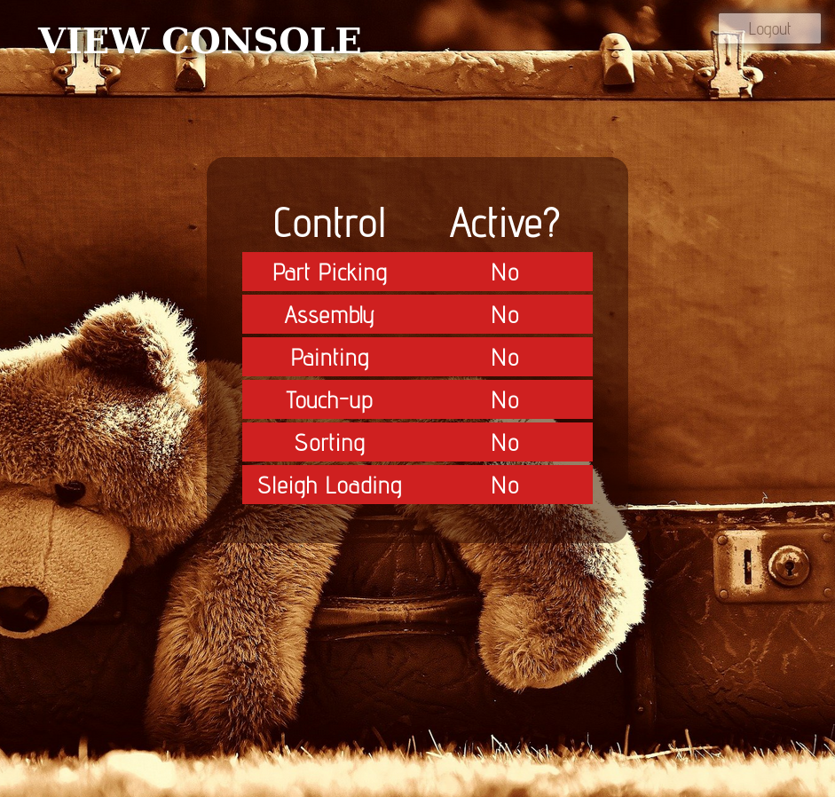
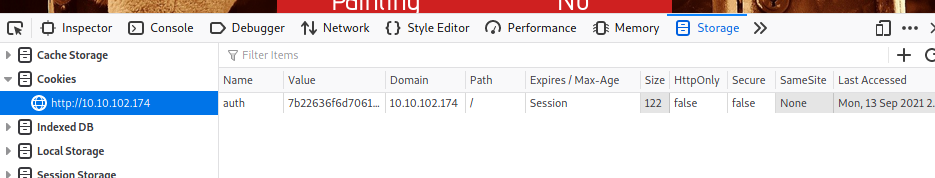
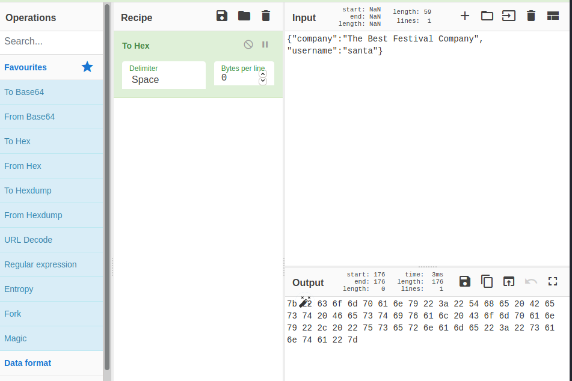

Advent of Cyber 2 - Day 1 - A Christmas Crisis
=============================

> Armand Alvarez | 13 Sept 2021

> github.com/Armand-Alvarez

> [TryHackMe Room Link](https://tryhackme.com/room/adventofcyber2)

---

# What is the name of the cookie used for authentication?

We are given an IP, which when put into a search bar takes us to a login page.

I registered a new profile with the service.

After logging in, there is a new page.

Opening the developer tools, we can see the name and value of the only cookie in use, likely an authentication cookie - it is **auth**

---

# In what format is the value of this cookie encoded?

We can copy and paste the value for further inspection:

`7b22636f6d70616e79223a22546865204265737420466573746976616c20436f6d70616e79222c2022757365726e616d65223a223132333435227d`

By looking at each value, we can see all values are between *0 - f* which is **hexadecimal**

---

# Having decoded the cookie, what format is the data stored in?

We can use a tool called [Cyber Chef](https://gchq.github.io/CyberChef/) to decode the hex. Select "From Hex" and paste the hex number into the "Input" section. 

The output is as such:

`{"company":"The Best Festival Company", "username":"12345"}`

If you don't recognize what format this data is right away, that is okay! Hacking is all about learning, you will never know everything.

One skill you need to become proficient at as a hacker is research. The clue for this task is: *Use CyberChef to decode the cookie. The format is a very common one, often linked to JavaScript. (https://gchq.github.io/CyberChef/#recipe=From_Hex('Auto'))*. This tells us not only what tool to use (which I didn't even know about, and will be bookmarking for future use) but also told us that it is a common format, often linked to JavaScript. 

Knowing this, I googled "javascript 'data format'" and the first result was JavaScript Object Notation (JSON). I did a little research on JSON and found that the format matched the above output. 

Hence, I realized that the format was, in fact, **JSON**.

---

# Figure out how to bypass the authentication. What is the value of Santa's cookie?

The cookie we just decoded (as seen above, with "Company" and "username" values) is an authentication cookie. What if we tried to change the username to Santa?

To do this, go back on Cyber Chef and change the username to Santa, then have it go *To* hex. It should look something like this:

**The output, without any spaces, is the value of Santa's cookie.**

---

# What is the flag you're given when the line is fully active?

We can take the value we got for the previous task and replace the authentication cookie's value with that. After, refresh the page and you should be logged in as Santa. If you are not, go back to Cyber Chef and check the spelling of the username. Input should look exactly like it does in the photo above. 

You can find the flag on the bottom of the page. 

---

Well done, and happy hacking!

