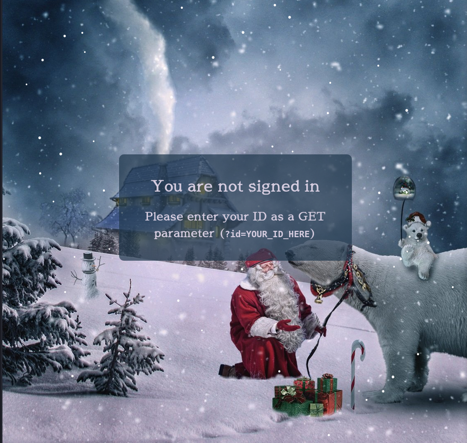
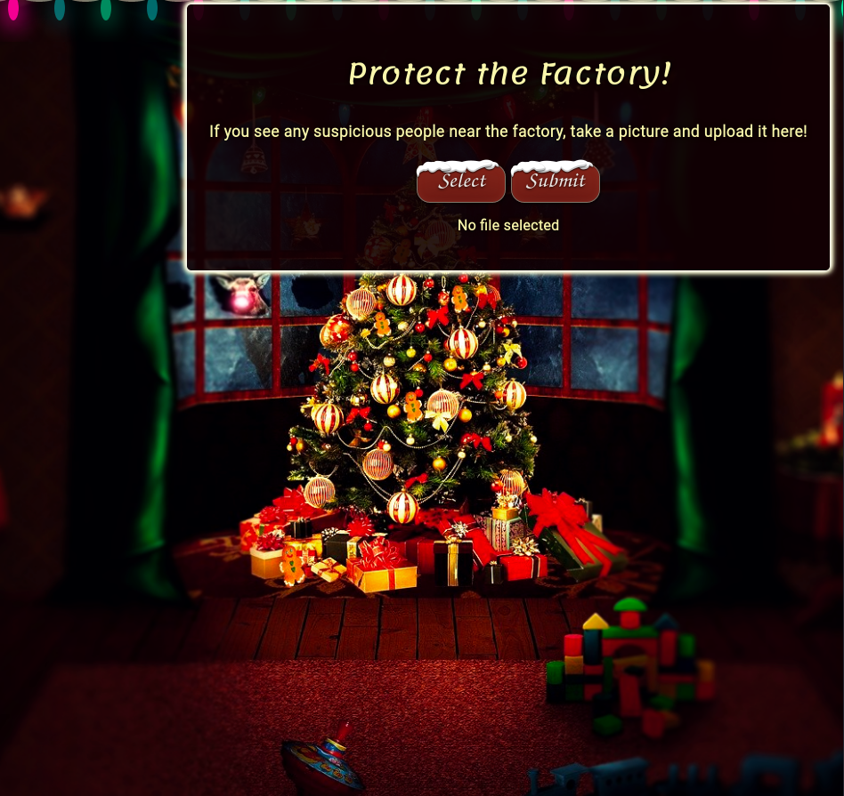
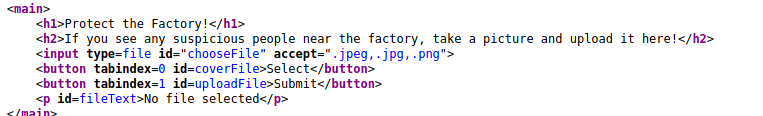
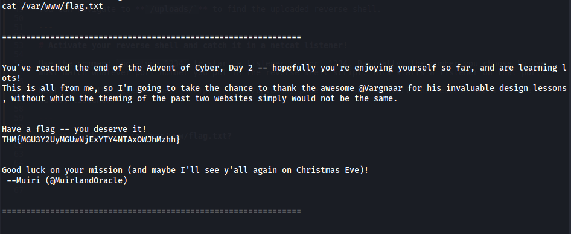

Advent of Cyber 2 - Day 2 - The Elf Strikes Back!
=================================================

> Armand Alvarez | 17 Sept 2021

> github.com/Armand-Alvarez

> [TryHackMe Room Link](https://tryhackme.com/room/adventofcyber2)

---

# What string of text needs adding to the URL to get access to the upload page?

We can access the website by simply putting the IP address into the browser's URL bar. 

The text asks us to enter our ID as a GET parameter. Appending **`?id=<your ID>`** allows us to navigate to a new page. 

---

# What type of file is accepted by the site?

We can inspect the source of the page by right-clicking, and choosing View Source. 

By inspecting the <input> element, we can see the file extentions it accepts. If this weren't here, we would likely have to brute force it (fuzz it) to see what file extentiosn would be accepted.

We can see that ".jpeg, .jpg, and .png" are accepted. These are all **image** file formats. 

---

# Bypass the filter and upload a reverse shell. In which directory are the uploaded files stored?

On kali linux, PHP reverse shells are stored here:  `/usr/share/webshells/php`

We can copy to the directory we are working in with `cp /usr/share/webshells/phpcp /usr/share/webshells/php/php-reverse-shell.php .` -- notice the period (.) after the first argument in the `cp` command. This period references the current directory. Two-periods (..) references the parent directory. 

Open the reverse shell in a text editor and change the IP to your VPN IP (found with `ip a s`) and the port to whatever port you want. 

After that, change the extention of the file with `mv <filename>.php <filename>.png.php`
This puts .png before .php which can trick some file extention checkers. 

Upload the file. 

You can navigate to **`/uploads/`** to find the uploaded reverse shell.

---

# Activate your reverse shell and catch it in a netcat listener!

Use the command `nc -lvnp 1234` to start a listener on port 1234. Basically, the number you choose to use must match whatever port number you put in the reverse shell script. This starts a listener on that port. 

Next, click the reverse shell script in the /uploads/ page. This should start the reverse shell on the netcat listener.

---

# What is the flag in /var/www/flag.txt?

You can read files with the `cat` command.

Type `cat /var/www/flag.txt` to read the file.

The flag is **THM{MGU3Y2UyMGUwNjExYTY4NTAxOWJhMzhh}**

---

That's all! Happy hacking :)

