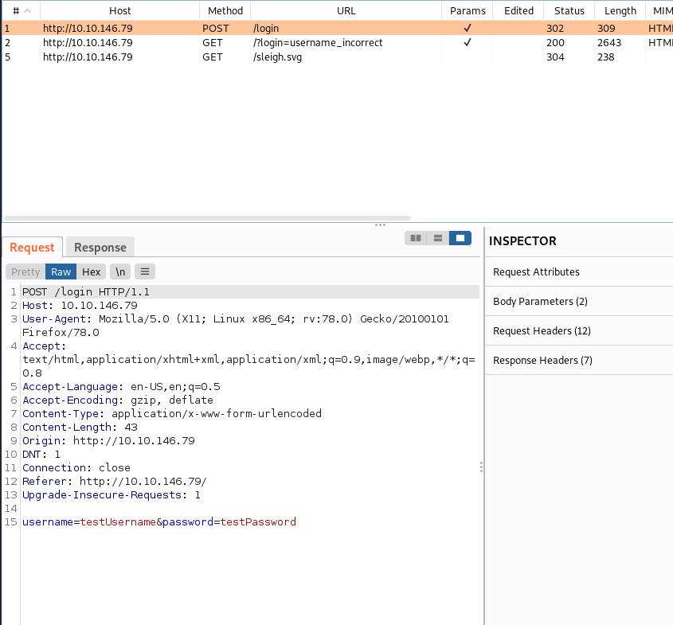
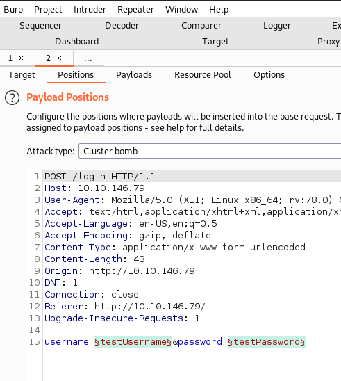
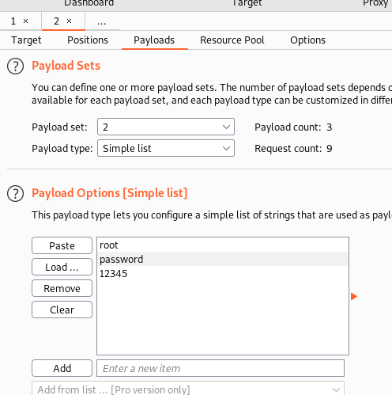
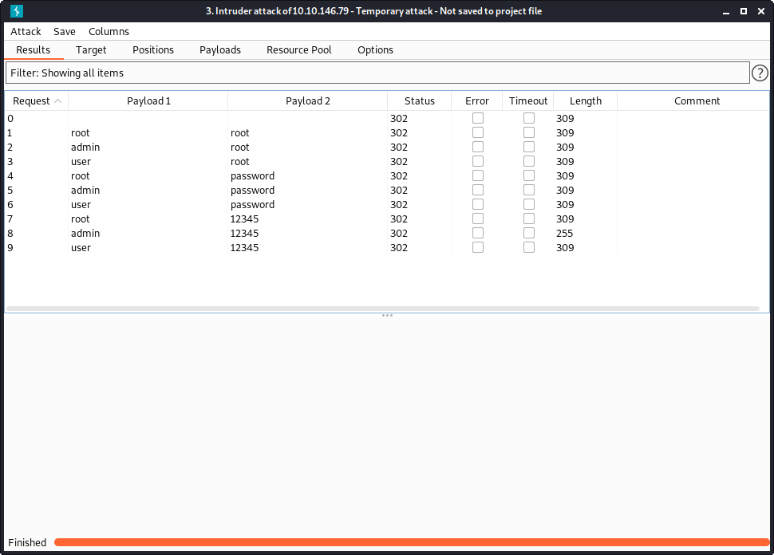
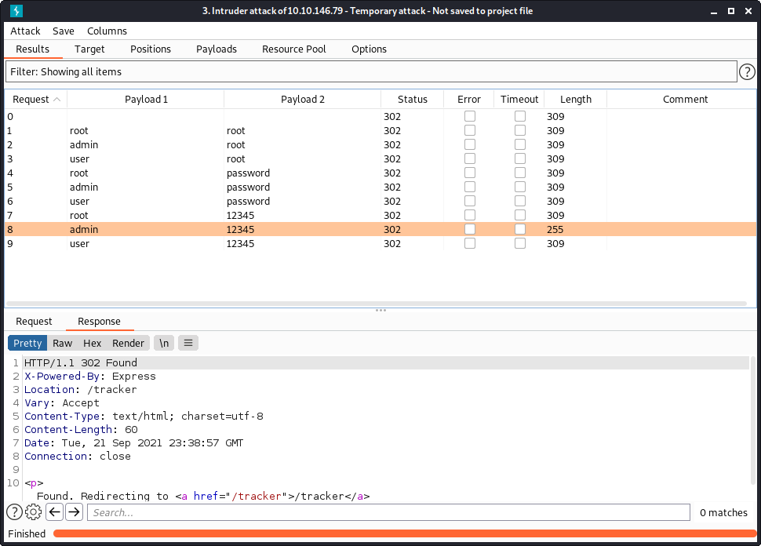
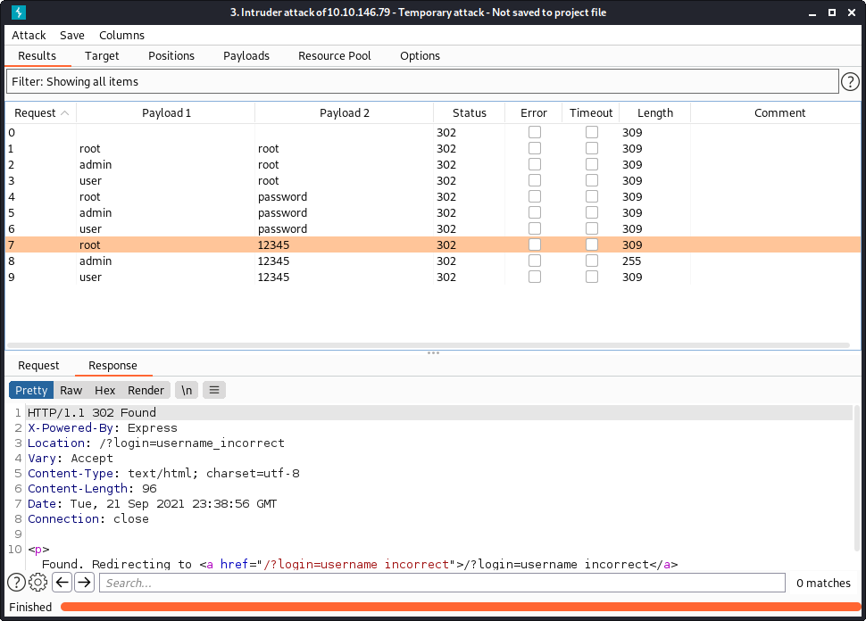
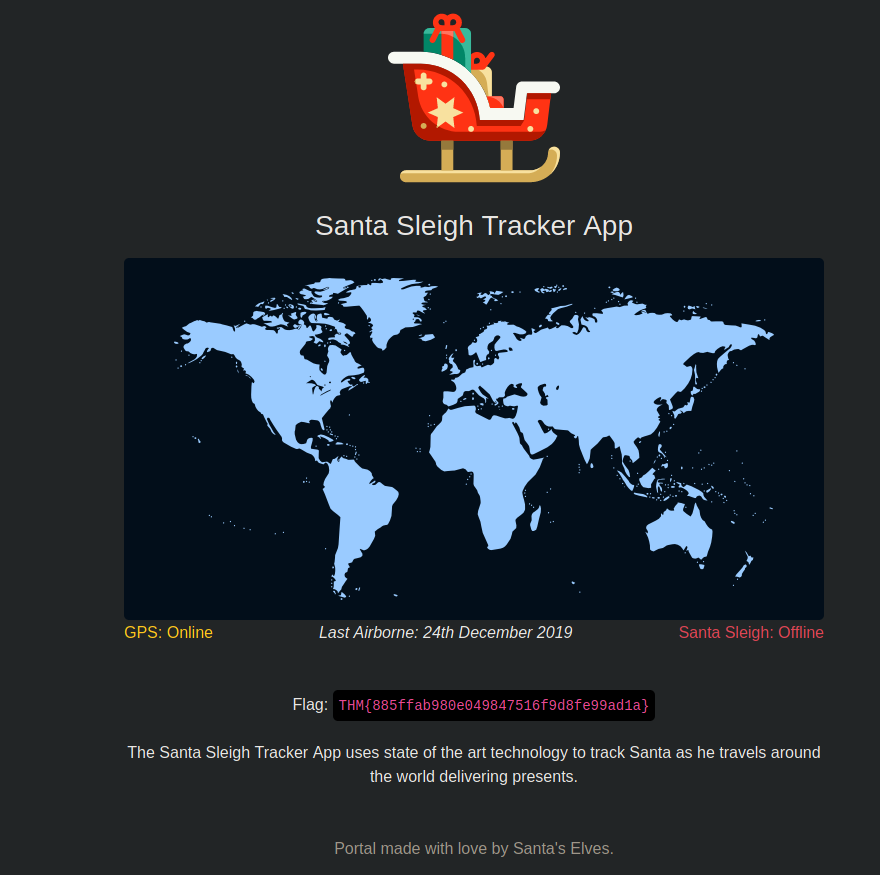

Advent of Cyber 2 - Day 2 - The Elf Strikes Back!
=================================================

> Armand Alvarez | 17 Sept 2021

> github.com/Armand-Alvarez

> [TryHackMe Room Link](https://tryhackme.com/room/adventofcyber2)

---

# What is the flag?

The prompt gives us a list of default credentials:

| Username | Password |
| -------- | -------- |
| root     | root     |
| admin    | password |
| user     | 12345    |

We are supposed to use burpsuite to brute force the website. Lets start by turning on our proxy and interception on BurpSuite. 

After, navigate to the website, put some dummy information into the username/password portion, and log in. 

Open BurpSuite proxy page and select the POST HTTP request. This should contain the username and password you input before. Right-click and send to the intruder.

So far, you put fake login credentials into the webpage and sent a *REQUEST* to the web server. The *POST* request is you sending the webserver information for it to work with, in this case it is login information. We captured that interaction with the webserver and you just sent it to Intruder for further analysis. 

Now, in the Intruder-> Positions tab, select the attack type cluster bomb, and the test username and test password you set. It should look like this:

Go to the payloads option and enter the 3 usernames into the Payload Options [Simple list] section. Then, in the Payload Sets, go to set 2, and put the 3 passwords into the same place. 

You can then run the intruder. 

Let me explain what just happened:

* We left the target as the IP and Port of the website (port 80 for HTTP)
* We chose the positions (targets) to be the *test username* and *test password* we put into the login portal before (during the capture phase)
* We chose the *cluster bomb* attack because that:
	* A) Uses multiple payload sets (which we were doing, one for username, one for password), and
	* B) Iterates through each payload. So it checks every combination of username and password.
* We then set our first Payload Set to be the username list we were given, and made the second Payload Set the password list

This is what our results should look like:

Notice anything? All the statuses are the same, but the *length* is different for one combination. Lets select that result and inspect it a little closer. Looking at the *Response* tab, we see:

It redirects us to a directory called `/tracker`. This is different than an incorrect username/password combination, which looks like this:

This redirects us to `/?login=username incorrect`. Remeber that the `?` in the URL means a GET request. It is sending a GET request where the variable *login* is set to *username incorrect*. 

We can now try this username password combination on the login form. It brings us to this page:

We can see that our flag is:

**THM{885ffab980e049847516f9d8fe99ad1a}**

--

Thats all! Happy hacking :)