Bounty Hacker
===============

> Armand Alvarez | 16 August 2021

> [github.com/Armand-Alvarez](github.com/Armand-Alvarez)

> [Room Link on TryHackMe](https://tryhackme.com/room/cowboyhacker)

---
# Find open ports on the machine

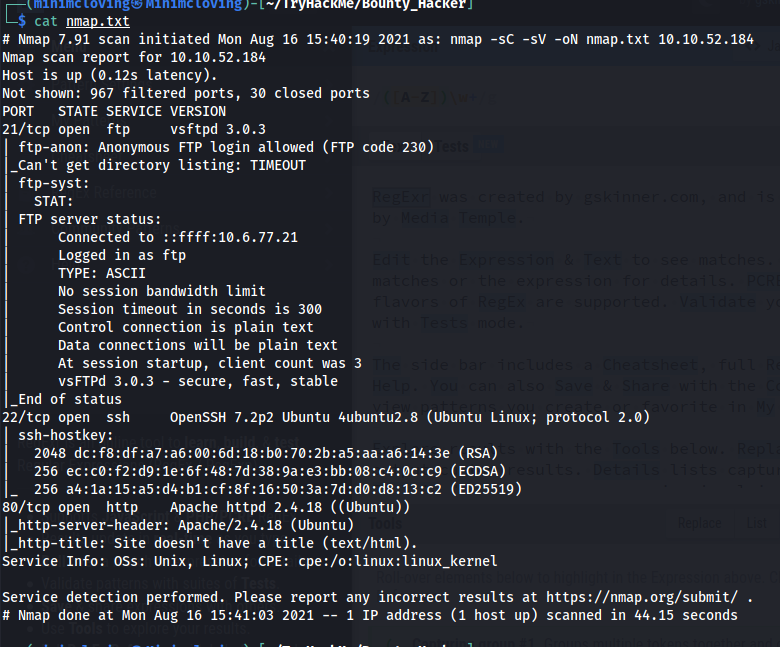

We can see we have the following ports open:

* 21 - ftp

* 22 - ssh

* 80 - http

---
# Who wrote the task list? 

## FTP

We can see from our nmap scan that ftp allows anonymous login so lets explore that first. 

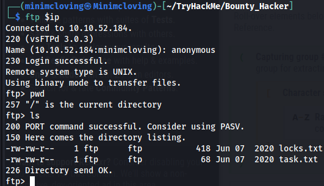

After logging in, we begin in the root directory with nothing but two files. We can download these to our local machine using the `wget` command.

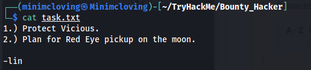

Reading the file on our local machine shows that **lin** wrote it.

---
# What service can you bruteforce with the text file found?

The other file we found is called *locks.txt*:

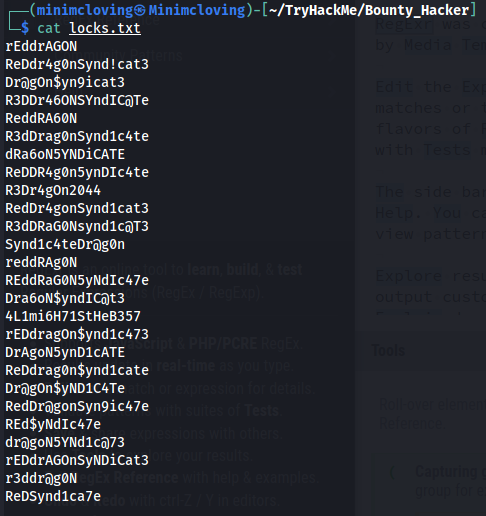

It looks like a file of possible passwords. We can try using this later.

Lets check out the website.

The homepage has nothing important in it, and the page source doesn't contain anything hidden either. 

Gobuster revealed a */images* directory that only stores the picture we see on the home page. Nothing important there.

Nikto revealed a few things, but nothing relevant right now:

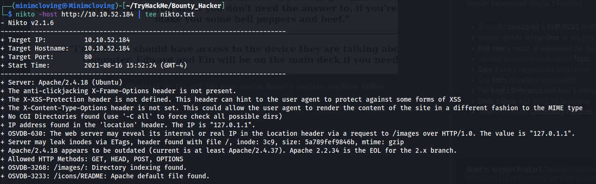

Given that the website has lead to a dead end right now, the only other service that we can use the password file on is **SSH**.

---
# What is the users password? 

Hint: *Hydra may be able to help.*

Lets use Hydra to try to figure out which password works with SSH. We can guess that *lin* is the username for SSH, figuring that is the only name we have gotten so far.

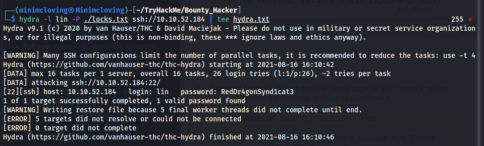

We see our successful password is **RedDr4gonSynd1cat3**.

Testing it on SSH works.

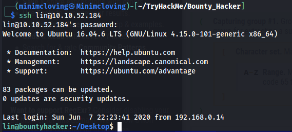

---
# user.txt

Once we get into the IP via SSH, we can `cat` the file.

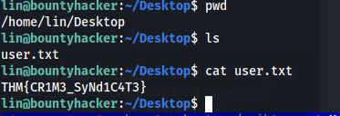

The flag for the user is: **THM{CR1M3_SyNd1C4T3}**

---
# root.txt

Running `sudo -l` as *lin* gives us the following:

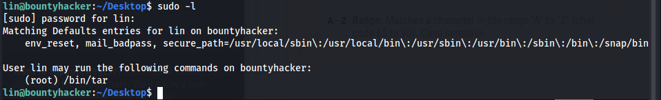

We can see that lin may run `/bin/tar` as *root*. This is great!

Getting on [gtfobins](https://gtfobins.github.io/gtfobins/tar/#sudo), we can search for "tar" and click *SUDO* (because we have sudo privilages for tar), and are given the following command:

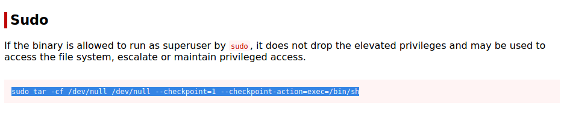

Once we run this command on the SSH terminal, we gain root privilages. We can then read root.txt to find the flag: **THM{80UN7Y_h4cK3r}**

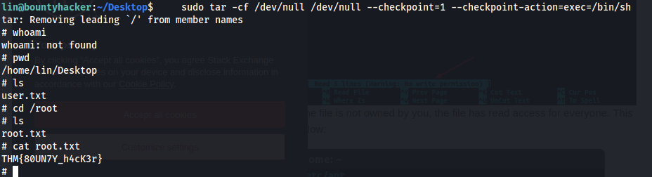

---

Thats all! Happy hacking.

:)