OhSINT
=================

> Armand Alvarez | 17 July 2021

> [Room link](https://tryhackme.com/room/ohsint)

------------------------

Task 1: OhSINT

First download the task file. 

## Inspecting the base image

Using the `eog <image.png>` command to view the image we just downloaded, all we see is the old WindowsXP background image. 

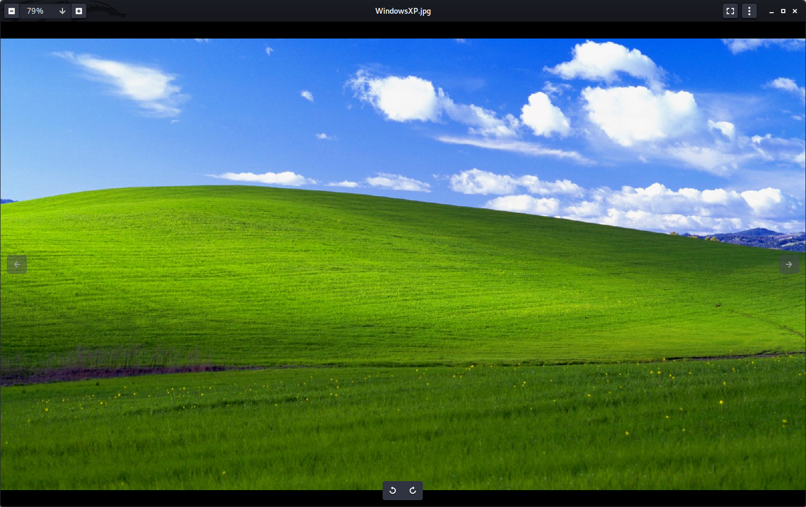

On its own, this is nothing important, but what if we could dig deeper into the image. 

## What is this users avatar of?

The very first question asks us what this users avatar is of. Looking at the original photo we downloaded, I have no idea. Lets use a tool called *Exiftool* to look at some metadata.

According to the man file *"Exiftool is a command-line interface..., used for reading and writing meta information in a variety of file types."* In other words, it is a steganography analysis tool. 

Using this tool, we can see metadata of the image, and find who holds the copywrite. 

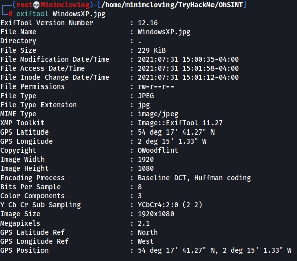

---------

# Searching for OSINT

We see an *OWoodflint* as the copyright holder for the image we downloaded. Lets look this up on google. 

The first result is this twitter account. 

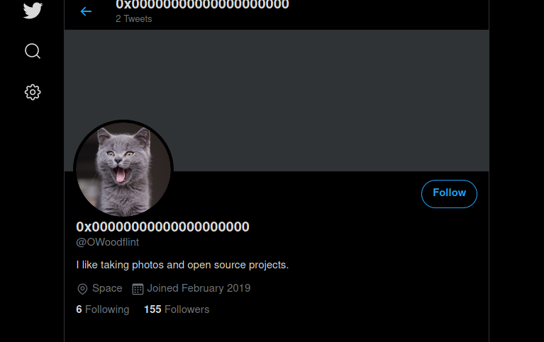

The first question asks what the user's avatar is, putting in `cat` is the correct answer. 

## What city is this person in?

The twitter account has two posts, one of which says:
	`From my house I can get free wifi ;D
	Bssid: B4:5D:50:AA:86:41 - Go nuts!`

The term `BSSID` is one used to describe a section of a wireless network (WLAN) - it stands for Basic Service Set Identifier. Basically the MAC address of the access point. It is a way of identifying access points and their associated clients. You can get more information [here](https://www.juniper.net/documentation/en_US/junos-space-apps/network-director3.7/topics/concept/wireless-ssid-bssid-essid.html)

This can be used to find the location of the WLAN. A website called [wigle.net](https://wigle.net/) "consolidates location and information of wireless networks world-wide to a central database." 

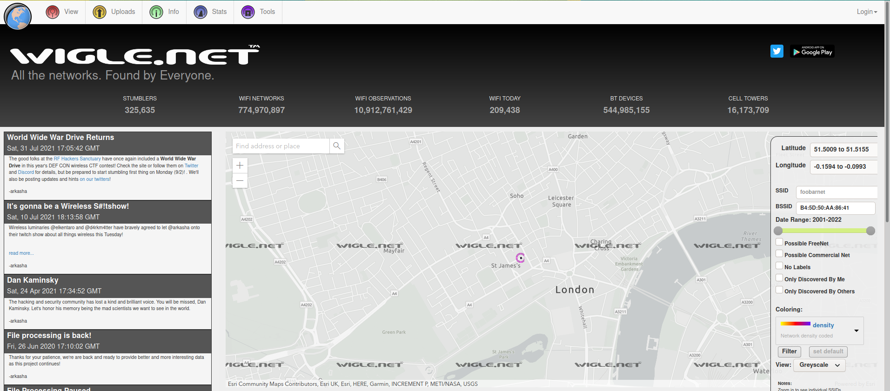

We can put the BSSID in wigle and find a location in `London`. 

## Whats the SSID of the WAP he connected to?

By creating an account, we can search up the BSSID and find the SSID of the WAP. We see the result shown is `UnileverWiFi`

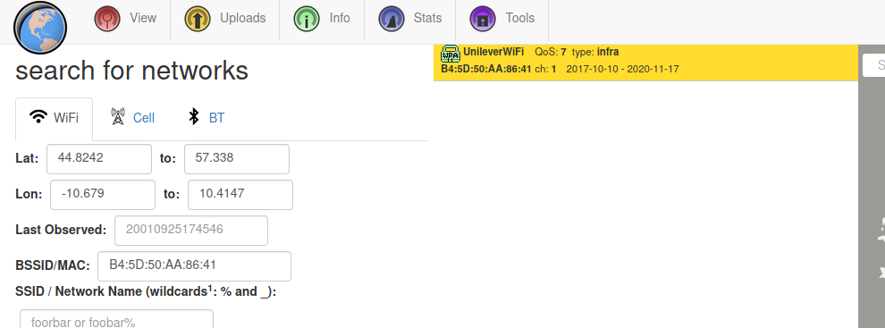

## What is his personal email address?

So, we basically got all we could out of the BSSID, lets look for another method of finding this person's email address. 

Our best tool is actaully google. We still have that username, `owoodflint`. Doing a simple google search of this also shows up the github. This has his email. 

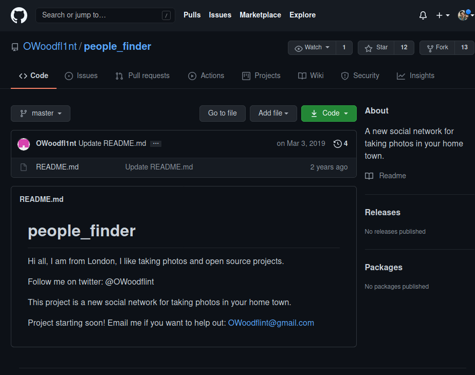

## What site did you find his email address on?

We found it on github! See the previous question above.

## Where has he gone on holiday?

There isn't much else on his github, we may return there later, but for now lets examine what other accounts we can find using google. 

OH! We see a wordpress blog.

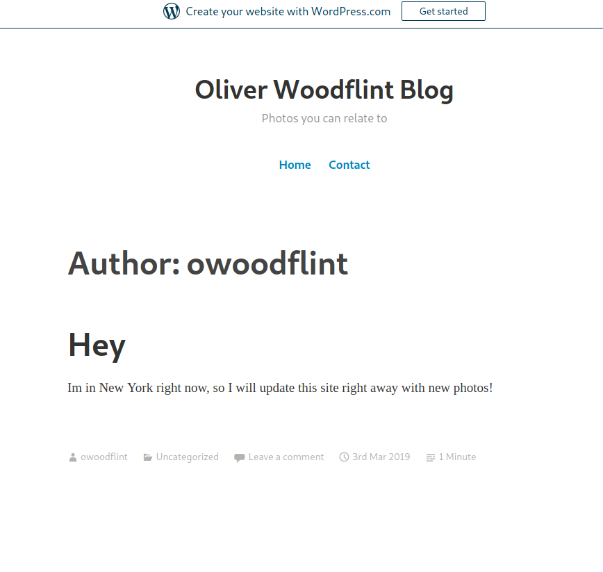

It says they are in `New York` right now, but we know that they live in London. So this must be where they are on vacation.

## What is this persons password?

This was a tough one, admittedly. I kept google dorking this dude's name in different ways, and was having trouble finding anything useful. (BTW I will give a big google dork hint to help you get less garbage in your google searches during a CTF at the **end of this page**)

Anyway, I looked back at the original google search of `owoodflint` and found something that stuck out to me. Take a look and see if you can spot it too. 

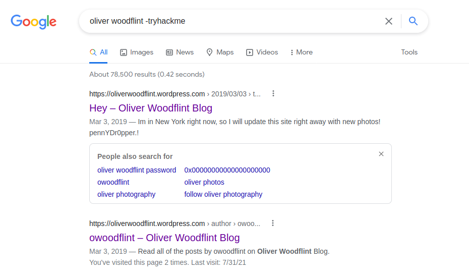

Did you see it? Look at the description of the first result. What is that word, "`pennYDr0pper`"? I don't remember seeing anything that ludicrious on the page! Lets take a closer look on the blog. 

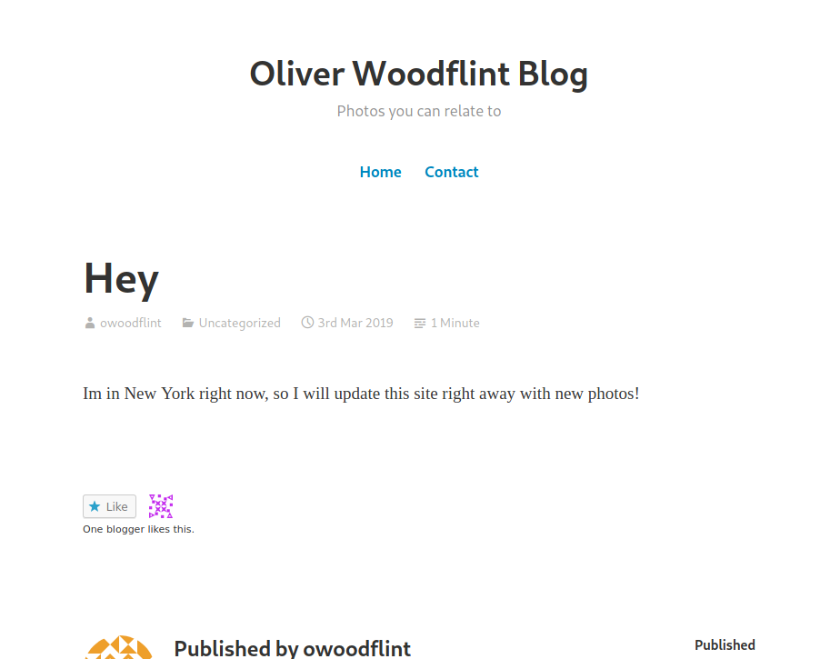

Its not on the page, *that we can see.* But the word came *right* after the word "*photos!*" in the google search result description. 

Lets try highlighting all the text with `ctrl + A`

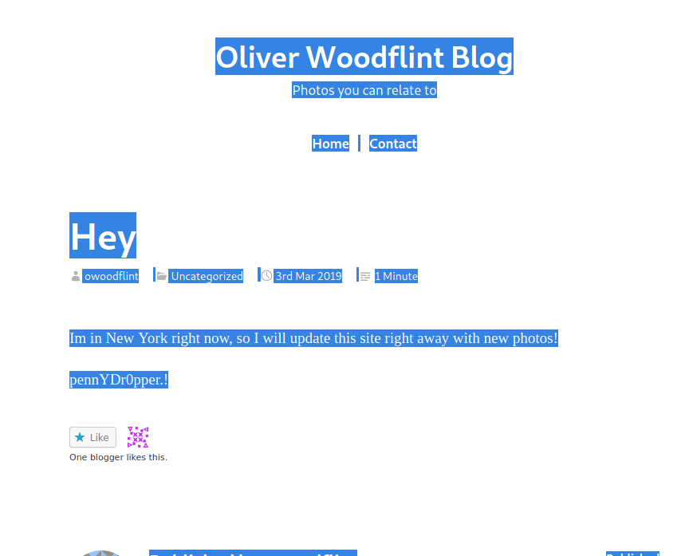

There it is! It looks to be the same format as our text input should be on the TryHackMe page, and it works as our password.

Also, for you dorks out there inspecting the source, you can find it there too.

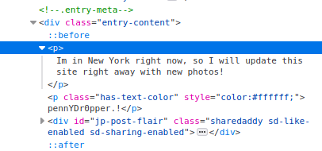

---

And thats all! But wait... 

If you looked closely at my search before, you may have seen it look a little weird:

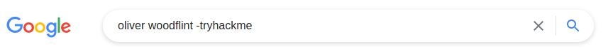

This is an example of whats called a *google dork* Google dorking, or google hacking, is a technique for finding open-source intelligence on Google. You can modify your google search to become more or less restrictive through google dorking. 

For example, in the picture I put `-tryhackme`. This is because a lot of the search results I would get when searching the phrase `oliver woodflint` or `owoodflint` would bring up writeups for the TryHackMe challenge that I was in the middle of doing. This is annoying to sift through, and can waste time figuring out what result is a writeup and what result is legitimate. 

So, when you put a `-` sign directly in front of a phrase in a google search, it tells google to hide any results with that phrase. So my `-tryhackme` took all the results that had the word `tryhackme` in it and threw them in the trash. You can also put stuff like `-osint`, `-OhSINT` (the name of the challenge), `-writeup` in the google search to really get rid of all the writeups and keep it only to the content that the CTF author intended to show up (plus maybe one or two legitimate people or businesses named Oliver Woodflint)

Have fun, and good luck on your OSINT adventures!

:)

