Simple CTF
====================

> Armand Alvarez | 11 August 2021

> [github.com/Armand-Alvarez](github.com/Armand-Alvarez)

> [Room link on TryHackMe](https://tryhackme.com/room/easyctf)

----------------------------------

Since this is a simple room, we will go through the questions and I will show my thought process and work to solve each question.

# How many services are running under port 1000?

To figure this out, we need to run a specific nmap command:

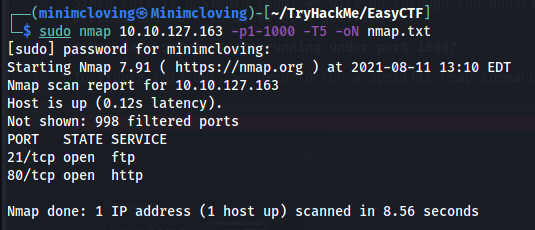

Lets go over this command:

`sudo nmap 10.10.127.163 -p1-1000 -T5 -oN nmap.txt`

* `sudo nmap 10.10.127.163` - Runs nmap as a superuser on IP 10.10.127.163 (this was the IP of the box I needed to get into)

* `-p1-1000` - Scan ports 1-1000 (the first 1000 ports)

* `-T5` - Run the fastest scan you can (1 is slowest, 5 is fastest)

* `-oN nmap.txt` - Put normal-output in the file *nmap.txt*

**We see that there are 2 ports open in the first 1000: port 21 and port 80!**

---

# What is running on the higher port?

We only see 2 ports with our small 1-1000 scan, but if we run a larger scan we may see more information.

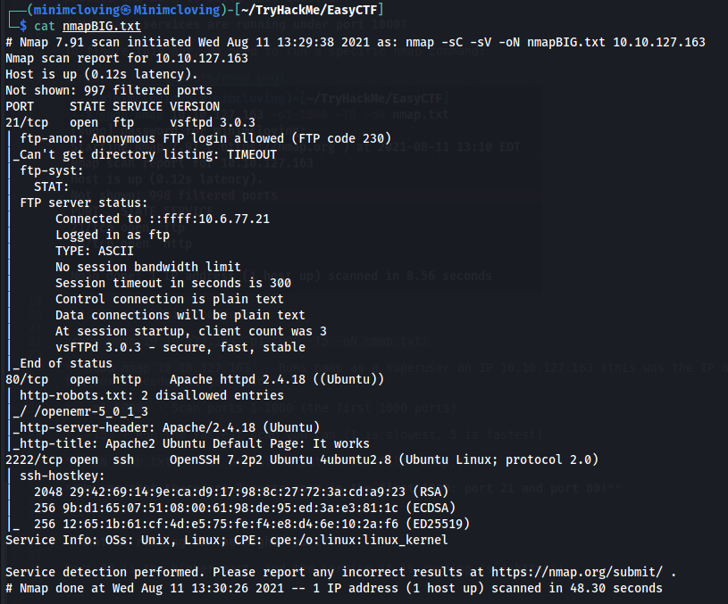

Running our scan with `-sC` and `-sV` we see the addition of a port 2222 running **ssh**
---

# What's the CVE you're using against the application? 

If we go to the ip address on a web browser, we are just greeted with the default Apache2 page.

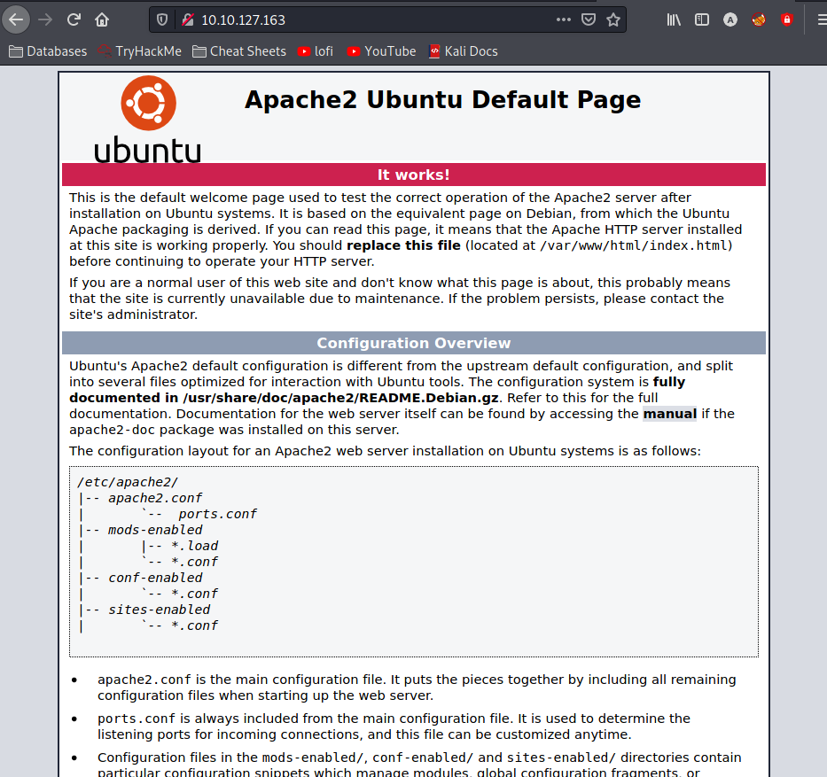

Running gobuster reveals */simple*. Lets check it out.

This is more interesting! Exploring the page also reveals the version of CMS:

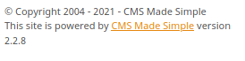

Let's search this version on ExploitDB to see if it reveals anything.

Searchsploit is a kali command that can search for exploits found on exploitDB. We searched for the keywords *cms*, *2.2.8*, *made*, and *simple*. It revealed an SQLI:

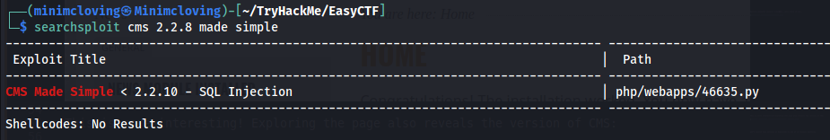

Running the same command with the `-w` argument will also show the exploit-db url, which will reveal the CVE number:

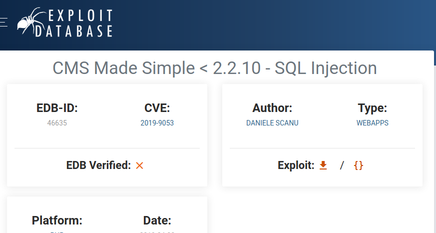

Looks like we are using **CVE-2019-9053**.

---

# To what kind of vulnerability is the application vulnerable?

We know this is a **SQLI** or an *sql injection*.

---

# What's the password?

To use the exploit, lets copy it into the current working directory. (I recommend making a separate directory for each TryHackMe room you do.)

Our original searchsploit result gave part of the path: *php/webapps/46635.py*.

We can run the following command to copy it to your current working directory:

`sudo cp /usr/share/exploitdb/exploits/php/webapps/46635.py exploit.py`

The exploit database is kept in /usr/share for kali linux users, we know it is an exploit by our searchsploit results, and the rest of the path was given to us. I saved it as *exploit.py* in my directory.

Now lets try running the exploit:

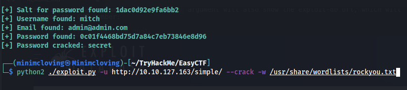

If you type in `python2 ./exploit.py`, it will give you examples usage of the exploit, which is how I knew what command to run. 

We see that the password is **secret**

---

# Where can you login with the details obtained?

We can log into the FTP server as anonymous and download the only file in it. It contains nothing important, so we don't need the login details there.

Trying the ssh we need a username and password, lets try Mitch and our newly obtained password.

`ssh mitch@10.10.127.163 -p 2222` - remember we have to use port 2222 because ssh is not running on port 22 on this box. Using the password we got earlier, we can successfully log in. 

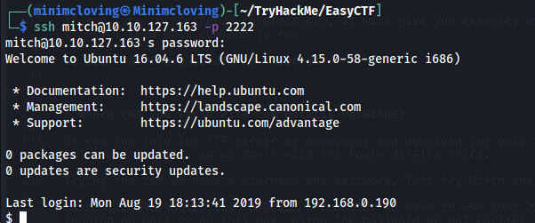

That shows us that the password can be used with **ssh**.

---

# What's the user flag?

We can see one file in the directory we start in, which is Mitch's home directory. Reading the file gives us the flag: **G00d j0b, keep up!**

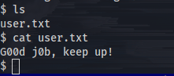

---

# Is there any other user in the home directory? What's its name?

If you do `ls /home`, you can see another user named: **sunbath**

---

# What can you leverage to spawn a privileged shell?

If you run the command `root -l`, it will show you what the user can run as root, and whether it requires a password:

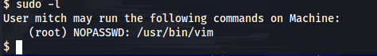

This shows us that Mitch may run /usr/bin/vim (**Vim**) without a password. 

---

# What's the root flag?

Head over to [gtfobins](https://gtfobins.github.io/), a great list of Unix binaries that can be used for privilege escalation. Type "vim" into the searchbar (because we know vim can be run as super user) and click on "Sudo". 

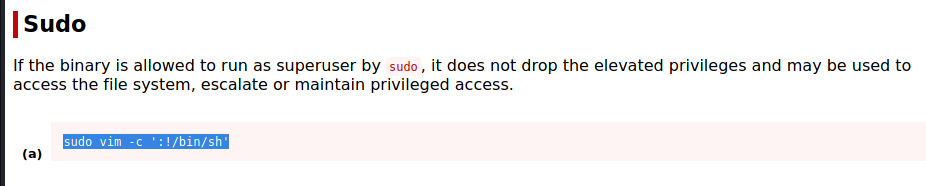

Run this command on the ssh shell and you will become root:

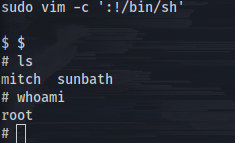

Congrats! You are now root simply because of a misconfigured vim. 

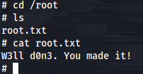

The flag is **W3ll d0n3. You made it!**! 

Happy hacking :)

